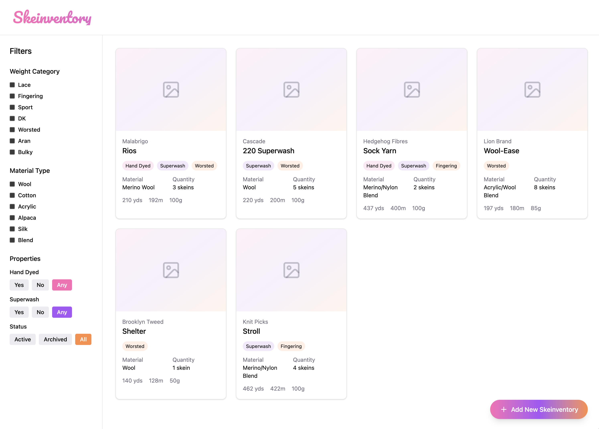
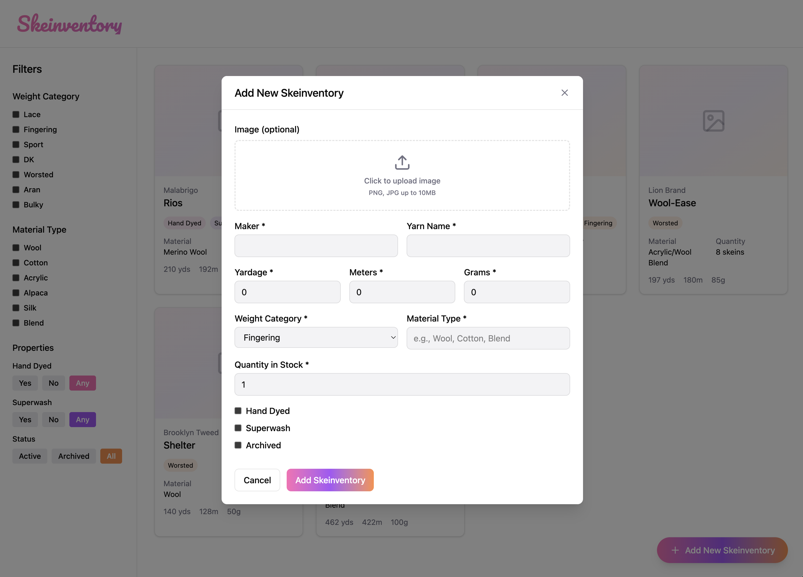

# Skeinventory UI Specification

## Purpose

This document defines the expected user interface behavior for Skeinventory. It is derived from Figma-generated designs and serves as the visual contract for implementation.

Copilot Agent Mode must treat these UI references as the source of truth for layout, structure, and interaction patterns.

---

## UI References

### Inventory View (Main Screen)

This screen represents the primary inventory browsing experience.

Key expectations:

* Inventory list is the primary focus
* Each yarn entry is visually represented as a card
* Archival state must be visually distinguishable (grayed or visually deprioritized)
* Filtering and search controls are accessible without navigating away

---

### Add Yarn Modal

This modal represents the create workflow for adding a new yarn entry.

Key expectations:

* Form is presented in a modal overlay
* Required fields are visually clear
* Optional fields are visually secondary
* Submit and cancel actions are clearly separated
* Validation errors appear inline near fields

---

## Layout Principles

* Inventory list is always visible as the primary context
* Create/edit flows use modal dialogs, not page navigation
* Form inputs must follow logical grouping:

  * Identity (name, maker)
  * Properties (weight, material)
  * Inventory quantities (skeins, grams, yards)
* User should never lose context when creating or editing yarn

---

## Interaction Rules

* Creating a yarn adds it immediately to the inventory list
* Modal closes only on successful submission or explicit cancel
* Validation errors must prevent submission
* Archived items remain visible but visually deprioritized

---

## Accessibility Requirements

* All form inputs must have explicit labels
* Modal must trap keyboard focus
* ESC must close modal
* Full keyboard navigation required for form submission

---

## Non-Negotiable UI Constraints

* Must match structure and hierarchy shown in Figma screens
* Must not introduce additional screens for core workflows
* Must not split Add Yarn flow into multiple steps
